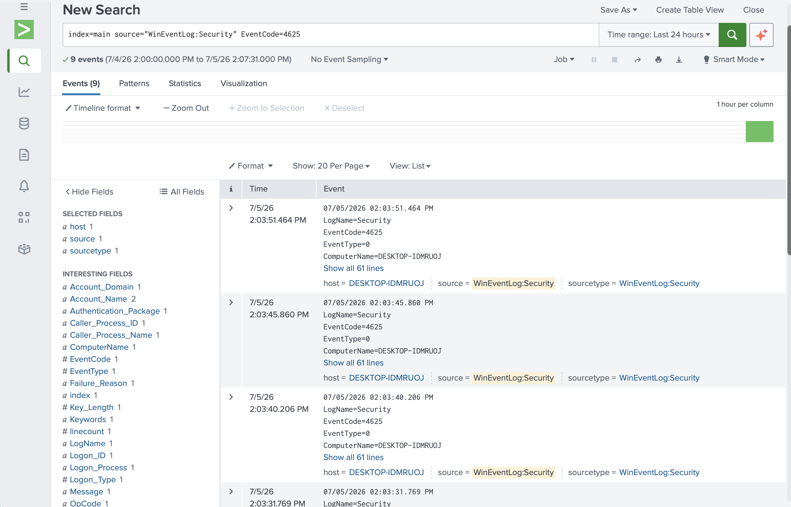
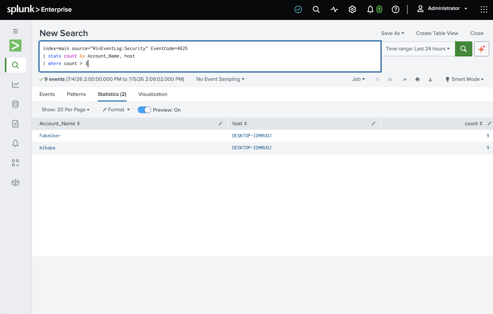
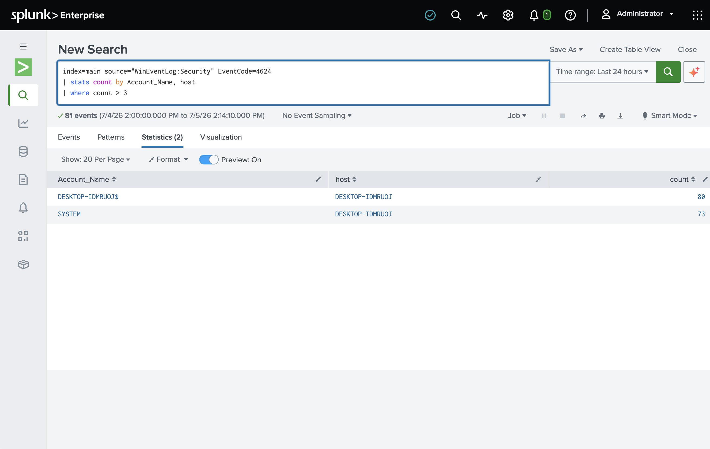
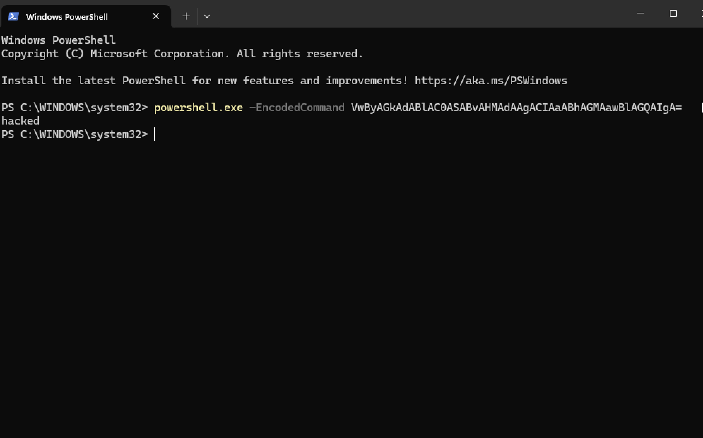
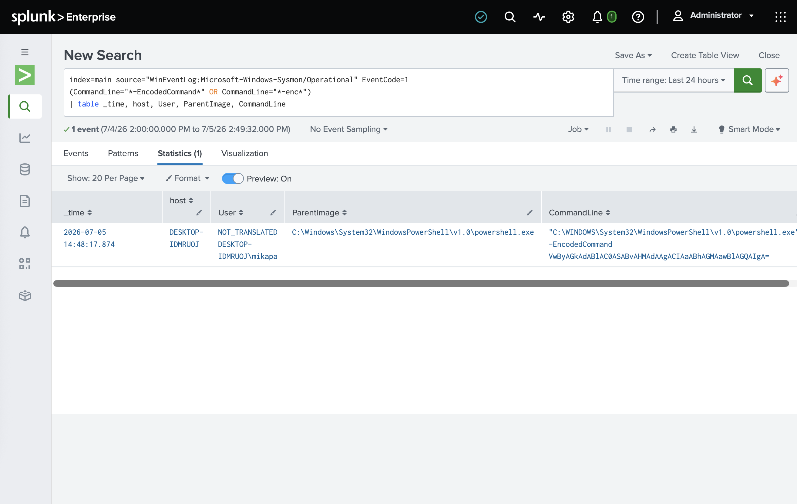
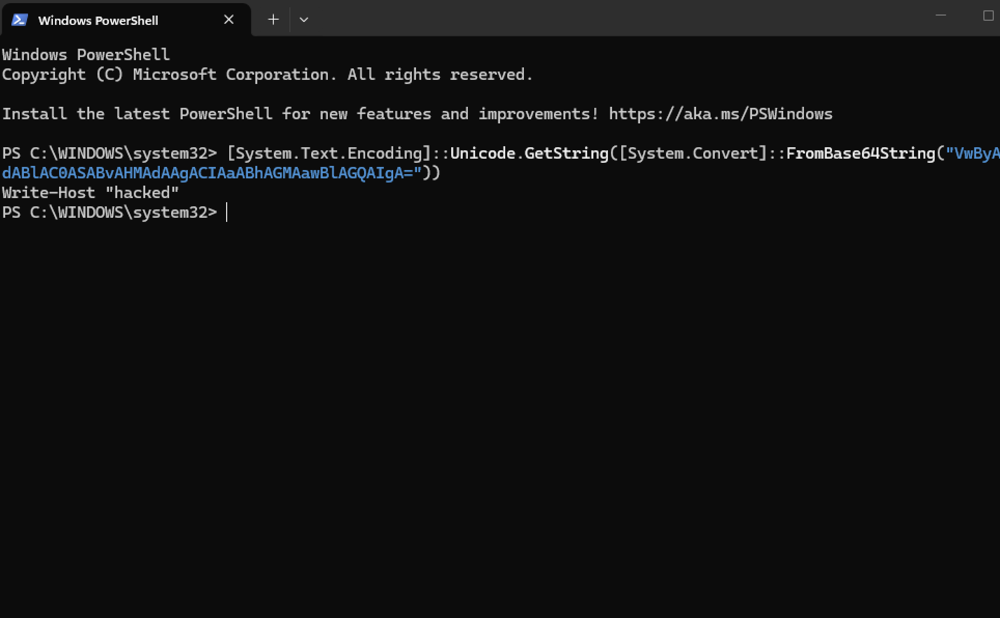
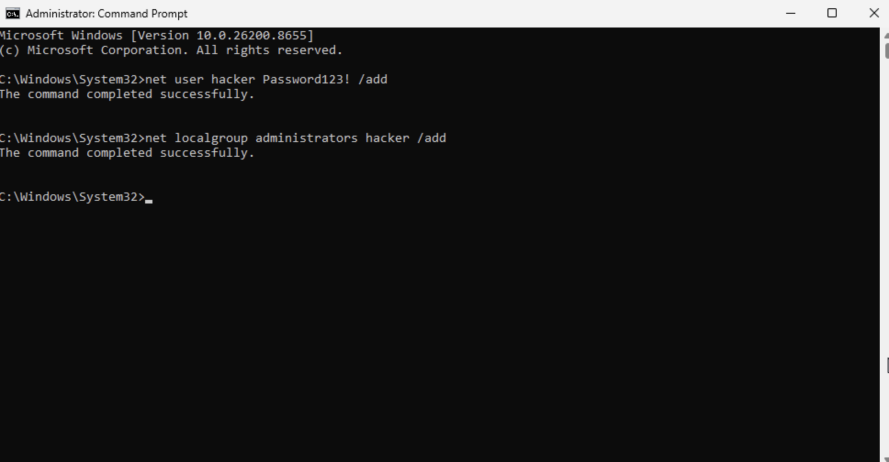
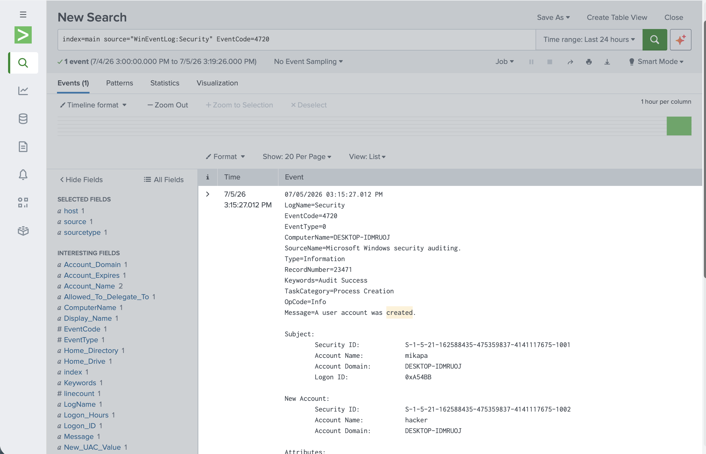
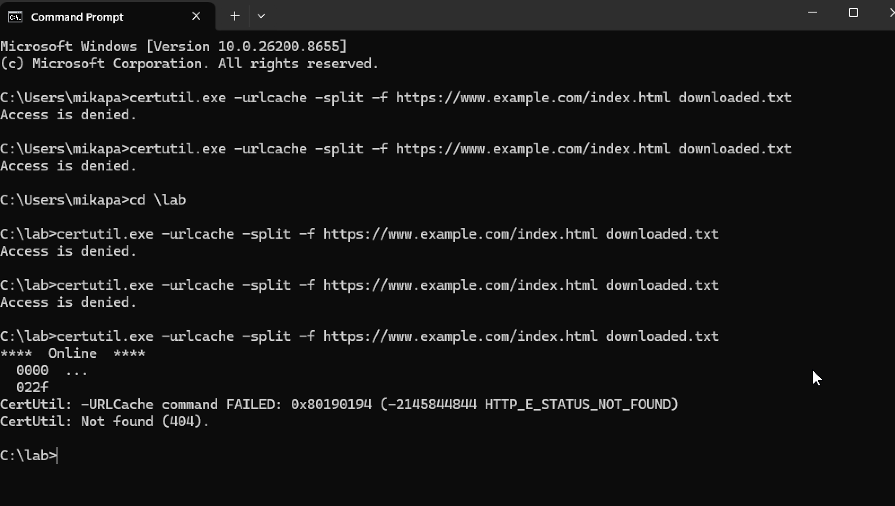
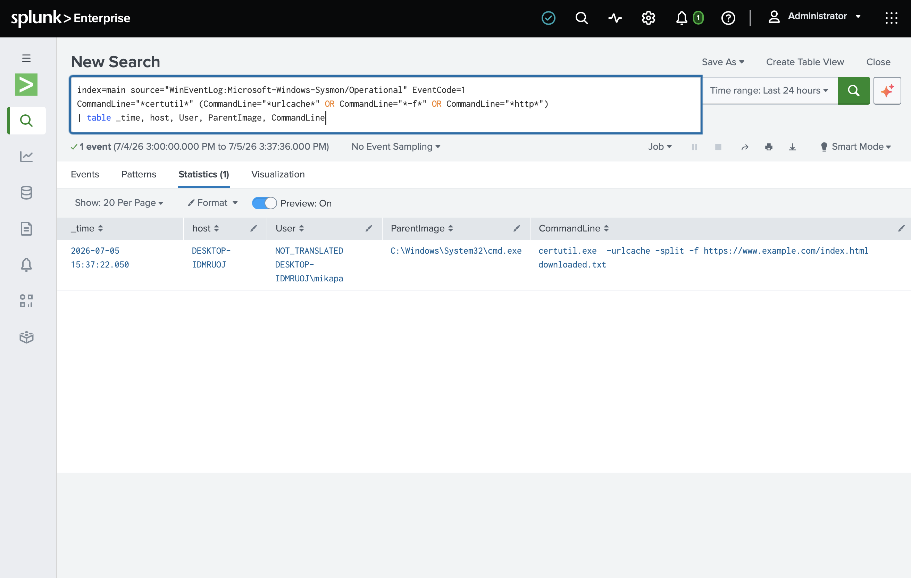

# Home SOC Lab — Detection Engineering with Splunk, Sysmon & MITRE ATT&CK

A hands-on Security Operations Center (SOC) lab built to practice the core
workflow of a SOC analyst: ingesting endpoint logs into a SIEM, simulating
adversary techniques, writing detections, and triaging the resulting alerts.

> **Status:** Log ingestion complete (Security, System, and Sysmon flowing into
> Splunk). Four detections built and documented across two log sources, mapped to
> MITRE ATT&CK.

---

## Objective

Stand up a working detection pipeline from scratch and demonstrate, for several
real attack techniques, the full path from **attack → log evidence → detection
→ triage**.

## Architecture

```
┌──────────────────────── Mac Mini (Apple Silicon, 24GB) ────────────────────────┐
│                                                                                  │
│   Windows 11 ARM VM (UTM)                        Splunk (SIEM, via Rosetta)      │
│   ┌──────────────────────────┐    logs :9997     ┌──────────────────────────┐   │
│   │ Sysmon + Universal Fwdr  │ ────────────────▶ │  Search & detections     │   │
│   └──────────────────────────┘                    └──────────────────────────┘   │
│              forwarder points at the host gateway (x.x.x.x:9997)                 │
└──────────────────────────────────────────────────────────────────────────────────┘
```

| Component | Tool |
|---|---|
| Host machine | Mac Mini (Apple Silicon / ARM64) |
| Hypervisor | UTM (QEMU) |
| Victim endpoint | Windows 11 ARM VM |
| Endpoint logging | Sysmon ARM64 (SwiftOnSecurity config) |
| Log shipping | Splunk Universal Forwarder |
| SIEM | Splunk (Free), running on macOS via Rosetta |
| Detection framework | MITRE ATT&CK |

## Log sources ingested

- Windows Security event log (logons, account management)
- Sysmon Operational log (process creation, network, DNS, file, registry)
- Windows System event log

**Proof of ingestion — Sysmon process-creation events (EventCode 1) in Splunk:**


Confirmed 430+ Sysmon EventCode 1 (process creation) events with full
`CommandLine`, `Image`, and `Hashes` fields extracted, forwarded from a
Windows 11 ARM VM through the Splunk Universal Forwarder.


> **Troubleshooting note:** Sysmon logs initially failed to forward — the
> Universal Forwarder returned `errorCode=5` (access denied) when subscribing to
> the `Microsoft-Windows-Sysmon/Operational` channel. Diagnosed via `splunkd.log`
> and resolved by configuring the forwarder service to run as **Local System**,
> which granted it rights to subscribe to the Sysmon channel. Security and System
> logs forwarded without issue; only the modern Sysmon channel required elevated
> privileges.

---

## Detections

Each detection below documents the attack run, its MITRE technique, the Splunk
search (SPL) that catches it, evidence, and triage notes.

| # | Technique | MITRE ID | Log source | Status |
|---|---|---|---|---|
| 1 | Brute-force login | T1110 | Security | ✅ |
| 2 | Encoded PowerShell | T1059.001 | Sysmon | ✅ |
| 3 | New local account created | T1136 | Security | ✅ |
| 4 | LOLBin download (certutil) | T1105 | Sysmon | ✅ |

---

### 1. Brute Force — T1110

- **Attack:** repeated failed logins against a local account using
  `runas /user:FakeUser cmd` with incorrect passwords.
- **Detection (SPL):**
  ```
  index=main source="WinEventLog:Security" EventCode=4625
  | stats count by Account_Name, host
  | where count > 3
  ```
- **Evidence:**

  
  

- **Investigation — did it succeed?** Pivoted from the failures (4625) to look
  for a matching success (4624) from the same account:
  ```
  index=main source="WinEventLog:Security" (EventCode=4624 OR EventCode=4625) Account_Name="FakeUser"
  | sort _time
  | table _time, EventCode, Account_Name, Logon_Type, host
  ```

  

- **Triage:** Multiple 4625 (failed logon) events from a single account in a
  short window indicate a brute-force attempt. Pivoted to EventCode 4624 to
  determine the outcome and reviewed `Logon_Type` and source host. If a
  successful logon follows the failures, the attack succeeded — disable the
  account, isolate the origin host, and investigate activity since the logon.

---

### 2. Encoded PowerShell — T1059.001

- **Attack:** ran a Base64-encoded PowerShell command to mimic obfuscation used
  to hide malicious scripts:
  ```
  powershell.exe -EncodedCommand VwByAGkAdABlAC0ASABvAHMAdAAgACIAaABhAGMAawBlAGQAIgA=
  ```
- **Detection (SPL):**
  ```
  index=main source="WinEventLog:Microsoft-Windows-Sysmon/Operational" EventCode=1
  (CommandLine="*-EncodedCommand*" OR CommandLine="*-enc*")
  | table _time, host, User, ParentImage, CommandLine
  ```
- **Evidence:**

  
  

- **Payload decode (triage step):** decoded the Base64 to reveal the true command:
  ```
  [System.Text.Encoding]::Unicode.GetString([System.Convert]::FromBase64String("VwByAGkAdABlAC0ASABvAHMAdAAgACIAaABhAGMAawBlAGQAIgA="))
  ```
  Result: `Write-Host "hacked"`

  

- **Triage:** Encoded PowerShell (`-EncodedCommand` / `-enc`) is a common
  defense-evasion technique — the encoding hides intent from casual log review.
  Decoded the Base64 payload to confirm what the command actually does, and
  checked `ParentImage` to see what launched PowerShell (a browser or Office
  parent would strongly suggest a malicious document/macro).

---

### 3. New Local Account Created — T1136

- **Attack:** created a new local account and granted it administrator rights, a
  common persistence mechanism (both commands completed successfully):
  ```
  net user hacker Password123! /add
  net localgroup administrators hacker /add
  ```

  

- **Detection (SPL):**
  ```
  index=main source="WinEventLog:Security" EventCode=4720
  | table _time, host, Account_Name, _raw
  ```
  *(Note: field extraction for the created/creator account varied — used the raw
  event to reliably read the new account name and the account that created it. A
  reminder that Splunk field names depend on parsing and aren't universal.)*
- **Evidence:**

  

- **Triage:** A new local account (`hacker`) was created and immediately added to
  the Administrators group. Unexpected account creation is a persistence
  technique. Confirm whether the action was authorized IT activity; if not,
  disable the account, review what it has done since creation, and investigate
  how the creating account was accessed.
- **Cleanup:** removed the test account afterward — `net user hacker /delete`.

---

### 4. LOLBin Download (certutil) — T1105

- **Attack:** used `certutil.exe` — a legitimate Windows certificate tool — to
  download a file from a URL, a classic "living off the land" technique:
  ```
  certutil.exe -urlcache -split -f https://www.example.com/index.html downloaded.txt
  ```

  

- **Detection (SPL):**
  ```
  index=main source="WinEventLog:Microsoft-Windows-Sysmon/Operational" EventCode=1
  CommandLine="*certutil*" (CommandLine="*urlcache*" OR CommandLine="*http*")
  | table _time, host, User, ParentImage, CommandLine
  ```
- **Evidence:**

  

- **Defense-in-depth observation:** Windows Defender initially **blocked** the
  execution (`Access is denied`) via a behavioural block on certutil reaching a
  URL — a preventive control doing its job. After running from a lab folder the
  process **executed**; it then returned `HTTP_E_STATUS_NOT_FOUND (404)` because
  the test URL had no file at that path. The key point for detection: certutil
  **launched**, so Sysmon captured the process-creation event and the detection
  fired regardless of the download's HTTP result. This demonstrated a
  **preventive** control (Defender) and a **detective** control (Sysmon/Splunk)
  operating together.
- **Triage:** `certutil` invoked with `-urlcache` and a URL is a known LOLBin
  pattern for pulling in additional tooling. Because it abuses a trusted signed
  binary, the detection keys on the *combination* of certutil + download
  arguments rather than certutil alone (which admins use legitimately). Triage:
  identify the URL and any downloaded file, hash and scan it, check `ParentImage`,
  and determine whether it was legitimate admin activity.

---

## What I learned

- **Sysmon dramatically enriches Windows logging** — default Windows logs don't
  capture process creation with command lines, hashes, and parent processes;
  Sysmon does, which is what makes behavioural detections possible.
- **Detection engineering is about suspicious *combinations*, not single events**
  — certutil alone is benign; certutil + a URL is the signal. Same with
  PowerShell + `-enc`.
- **How log forwarding works end to end** — the Universal Forwarder ships
  specified channels (`inputs.conf`) to the Splunk indexer over port 9997.
- **VM-to-host networking** — on UTM's shared network, the forwarder had to point
  at the host gateway, not `127.0.0.1`, since Splunk runs on the Mac host, not
  inside the VM.
- **Reading `splunkd.log` to diagnose ingestion gaps** — the `errorCode=5`
  Sysmon channel issue was solved by reading the forwarder's own logs rather than
  guessing, then fixing the service's logon account.
- **Field names aren't universal** — expected fields came back empty on the 4720
  event; found the real values by expanding the raw event. This "the field is
  empty, let me look at the raw log" habit is core investigative work.
- **Defense-in-depth in action** — observed a preventive control (Defender) and a
  detective control (Sysmon) interacting during the certutil test.
- **Running Windows 11 on Apple Silicon** — required the ARM64 Windows build,
  ARM64 Sysmon, and the virtio/SPICE guest drivers for networking.

## Next steps

- Map detection coverage with the MITRE ATT&CK Navigator
- Add a second log source (Linux auth logs)
- Convert saved searches into scheduled alerts (would require Splunk Enterprise
  or a switch to Elastic/Sentinel, since Splunk Free lacks scheduled alerting)
- Run a honeypot and analyze real-world attack traffic
