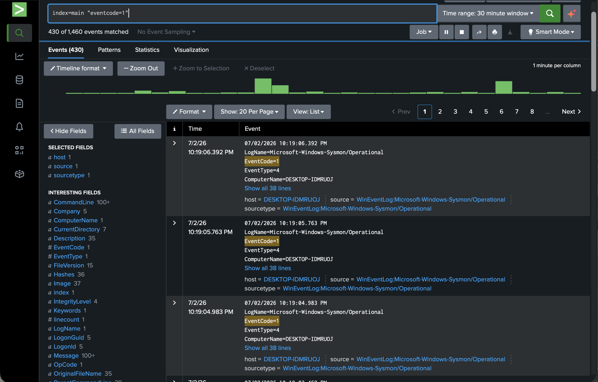
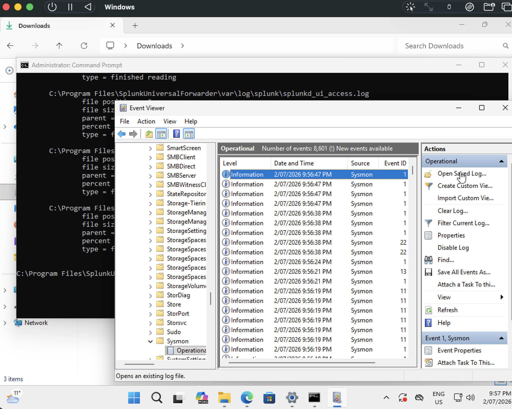

# Home SOC Lab — Detection Engineering with Splunk, Sysmon & MITRE ATT&CK

A hands-on Security Operations Center (SOC) lab built to practice the core
workflow of a SOC analyst: ingesting endpoint logs into a SIEM, simulating
adversary techniques, writing detections, and triaging the resulting alerts.

> Status: 🚧 In progress — log ingestion complete (Security, System, and Sysmon
> all flowing into Splunk). Attack simulation and detections coming next.

---

## Objective

Stand up a working detection pipeline from scratch and demonstrate, for several
real attack techniques, the full path from **attack → log evidence → detection
→ triage**.

## Architecture

```
┌──────────────────────── Mac Mini (Apple Silicon, 24GB) ────────────────────────┐
│                                                                                  │
│   Windows 11 ARM VM (UTM)                        Splunk (SIEM, via Rosetta)      │
│   ┌──────────────────────────┐    logs :9997     ┌──────────────────────────┐   │
│   │ Sysmon + Universal Fwdr  │ ────────────────▶ │  Search & detections     │   │
│   └──────────────────────────┘                    └──────────────────────────┘   │
│              forwarder points at the host gateway (192.168.64.1:9997)            │
└──────────────────────────────────────────────────────────────────────────────────┘
```

| Component | Tool |
|---|---|
| Host machine | Mac Mini (Apple Silicon / ARM64) |
| Hypervisor | UTM (QEMU) |
| Victim endpoint | Windows 11 ARM VM |
| Endpoint logging | Sysmon ARM64 (SwiftOnSecurity config) |
| Log shipping | Splunk Universal Forwarder |
| SIEM | Splunk (Free), running on macOS via Rosetta |
| Attack simulation | Atomic Red Team |
| Detection framework | MITRE ATT&CK |

## Log sources ingested

- Windows Security event log (logons, account management)
- Sysmon Operational log (process creation, network, DNS, file, registry)
- Windows System event log

**Proof of ingestion — Sysmon process-creation events (EventCode 1) in Splunk:**



Confirmed 430+ Sysmon EventCode 1 (process creation) events with full
`CommandLine`, `Image`, and `Hashes` fields extracted, forwarded from a
Windows 11 ARM VM through the Splunk Universal Forwarder.



> **Troubleshooting note:** Sysmon logs initially failed to forward — the
> Universal Forwarder returned `errorCode=5` (access denied) when subscribing to
> the `Microsoft-Windows-Sysmon/Operational` channel. Diagnosed via `splunkd.log`
> and resolved by configuring the forwarder service to run as **Local System**,
> which granted it rights to subscribe to the Sysmon channel. Security and System
> logs forwarded without issue; only the modern Sysmon channel required elevated
> privileges.

---

## Detections

> Coming soon. For each technique I'll document: the attack run, the MITRE
> technique ID, the Splunk search (SPL) that catches it, a screenshot of the
> detection firing, and triage notes.

| # | Technique | MITRE ID |
|---|---|---|---|
| 1 | Brute-force login | T1110 |
| 2 | Encoded PowerShell | T1059.001 |
| 3 | New local account created | T1136 |
| 4 | LOLBin download (certutil) | T1105 |

### Example detection format (to be filled in)

**T1110 — Brute Force**

- *Attack:* repeated failed logins against the victim, followed by a success.
- *Detection (SPL):*
  ```
  index=main source="WinEventLog:Security" EventCode=4625
  | stats count by Account_Name, host
  | where count > 3
  ```
- *Evidence:* [Logs](T1110_a.png)
- [Stats](T1110_b.png)
- [Successful logins](T1110_S.png)
- *Triage:* [true/false positive? next investigative step — check for a
  following 4624 success, source IP, account targeted, recommended response.]

---

## What I learned

- **Sysmon dramatically enriches Windows logging** — default Windows logs don't
  capture process creation with command lines, hashes, and parent processes;
  Sysmon does, which is what makes behavioural detections possible.
- **How log forwarding works end to end** — the Universal Forwarder ships
  specified channels (`inputs.conf`) to the Splunk indexer over port 9997.
- **VM-to-host networking** — on UTM's shared network, the forwarder had to point
  at the host gateway (`192.168.64.1`), not `127.0.0.1`, since Splunk runs on the
  Mac host, not inside the VM.
- **Reading `splunkd.log` to diagnose ingestion gaps** — the `errorCode=5`
  Sysmon channel issue was solved by reading the forwarder's own logs rather than
  guessing.
- **Running Windows 11 on Apple Silicon** — required the ARM64 Windows build,
  ARM64 Sysmon, and the virtio/SPICE guest drivers for networking.

## Next steps

- Run the four attacks above and document each detection with SPL + screenshot + triage
- Map detection coverage with the MITRE ATT&CK Navigator
- Add a honeypot and analyze real-world attack traffic
